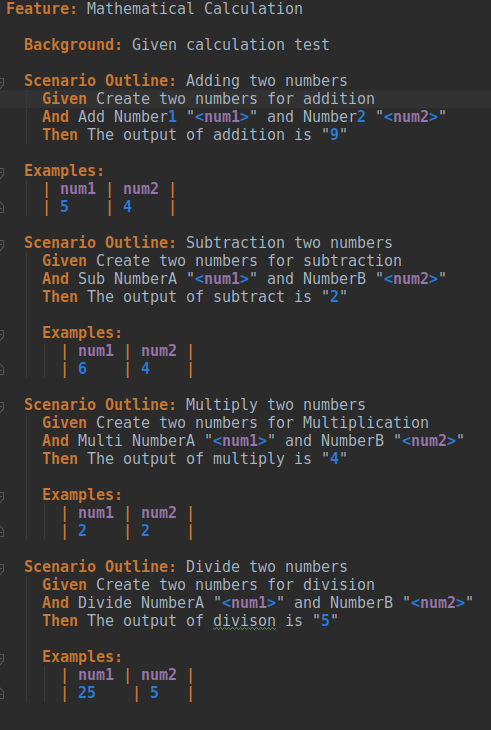

# springboot-cucumber-demo
This project explains how to use BDD using cucumber in springboot

### Cucumber

    * **Cucumber** is a high-level testing framework that supports **behaviour driven development**.
    
    * It runs automated acceptance tests on web applications
    
    * **Cucumber** is a tool that executes plain-text functional descriptions as automated tests. 
      The language that Cucumber understand is **_Gherkin_**.
      

    ..*_**Flow**_
    
        1. Describe behaviour.
        2. Write Step definition.
        3. Run and Fail.
        4. Write code to make step pass.
        5. Run and pass.

    ### Feature File Introduction
    
    ...Feature Introduction Every .feature file conventionally consists of a single feature. A line starting with the keyword Feature followed by free indented text starts a feature. A feature usually contains a list of scenarios. scenarios together independent of your file and directory structure.
    
    **Given** -> What software will look like to user
    
    **When**  -> Things that the user will do
    
    **Then**  -> What the user should expect
    

### Calculator Application

    Here I take simple calculation application which has addition, subtraction, multiplication and divison.
    
    I made simple calcuation service in rest using springboot for add, sub, multi and divide.
    
        ⋅⋅⋅For example if you hit the url after the starting spring boot application the output will be like this.⋅⋅
        
              Rest URL : **http://localhost:8081/calc/add/5/4**
              Output   : **Addition of 5 + 4 is 9**
              
        ⋅⋅⋅Similar for sub, multi and divide.⋅⋅
        
### Cucumber Configuration and Feature File

* calculation.feature

        
        
        
* CucumberConfig.java
